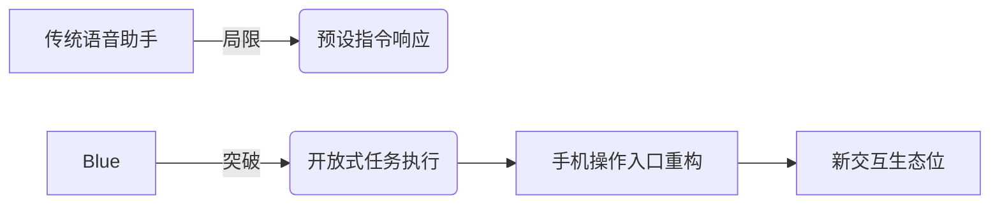

## 公司概况
> "Blue is the first voice assistant that can control every app on your phone."  
Blue 旨在通过**语音交互彻底取代触屏操作**，解决传统语音助手（如Siri/Alexa）仅能执行基础指令的痛点。其核心创新在于：
- **无应用集成依赖**：通过模拟人类点击/滑动/输入行为，兼容Android与iOS任意APP
- **硬件+软件融合方案**：定制硬件设备增强交互可靠性
- **场景验证**：已实现通勤、烹饪等场景的免提短信、购物、导航操作

公司2024年创立，2025年入选Y Combinator夏季批次，团队3人，总部位于硅谷核心区圣克拉拉。

---

## 技术与市场成熟度（TM/SR）

### 技术成熟度（TM：3/5）
| 维度       | 现状描述                                                                 | 关键支撑证据                     |
|------------|--------------------------------------------------------------------------|----------------------------------|
| **核心技术** | 语音控制模型（LLM驱动）达到早期商用水平                                   | Omar专利的LLM计算机控制框架      |
| **硬件集成** | 原型机完成基础验证，未披露量产进度                                       | Farhan的Vision Pro量产经验迁移   |
| **跨平台性** | Android实现基础操作，iOS兼容性待验证                                     | 官网仅开放Android测试            |
| **鲁棒性**  | 需应对复杂场景（网络波动/背景噪音）                                      | 未公开压力测试数据               |

**结论**：**技术突破性强但工程化不足**，需解决长尾场景下的操作精度问题。

### 场景成熟度（SR）
- **用户验证阶段**  
  > "Users are texting, shopping, and navigating completely hands-free"  
  - PoC进展：早期用户实现基础免提操作（短信/导航/购物）  
  - 核心场景：通勤（驾驶）、烹饪（手部占用）、残障辅助  
  - ROI路径：尚未建立订阅制或硬件定价模型  
- **可复用交付瓶颈**  
  - 硬件依赖可能抬高用户门槛  
  - 未验证高噪声环境（如地铁）的可用性  

---

## 团队与创始人画像（PO）
### 创始人特质三角
| 创始人          | 功能性角色（FMF）      | 完整性（Completeness）                          | 执行动能证据                     |
|-----------------|------------------------|------------------------------------------------|----------------------------------|
| **Omar Abdelaziz** | 技术架构师             | 谷歌助手LLM转型主导者+专利发明人               | 3个月从0到1上线Android测试版     |
| **Peter Krogh**   | 交互系统设计师         | 20年语音对话系统经验，Gemini Live设计负责人     | 设计方法论覆盖SFT/RLHF全流程     |
| **Farhan Hossain**| 硬件工程与量产专家     | 50+专利，Vision Pro从概念到量产核心成员         | 苹果级供应链管理经验             |

**团队优势**：  
- **罕见互补性**：谷歌AI基因（Omar/Peter）+苹果硬件基因（Farhan）  
- **规模级产品经验**：三人累计服务用户超10亿  
- **快速验证能力**：6个月内完成原型→用户测试  

**隐患**：  
- **硬件依赖风险**：Farhan同时担任外部顾问（noble.Crafters），精力分散  
- **零ToC增长经验**：团队背景集中于大厂B端产品，未经历冷启动  

---

## 机会与趋势（OP）
### 行业位势分析


**差异化机会**：  
1. **技术空白**：首个实现“任意APP控制”的语音方案，避开Siri/Alexa的API集成竞争  
2. **场景红利**：  
   - 残障市场刚需（全球16亿视障人群）  
   - 多任务场景渗透（驾驶合规需求上升）  
3. **生态杠杆**：硬件设备可能成为AI手机时代交互外设  

**外部变量**：  
- 苹果/谷歌若开放系统级操控API，技术护城河将受冲击  

---

## 风险与挑战（RK）
### 风险地图
| 风险类别        | 具体表现                          | 触发信号                     | 缓释路径                     |
|-----------------|-----------------------------------|------------------------------|------------------------------|
| **技术风险**    | 复杂操作错误率飙升                | 用户投诉“误购商品”事件       | 建立操作确认双保险机制       |
| **合规风险**    | 隐私数据获取争议                  | 欧盟GDPR质询                 | 本地化数据处理架构           |
| **供应链风险**  | 硬件量产延迟                      | 关键元件交期>6个月           | 预采购核心芯片               |
| **竞争风险**    | 巨头复制技术路线                  | 谷歌发布屏幕控制Agent专利    | 加速专利布局（已申请1项）   |

**致命短板**：  
> "iPhone coming soon"  
**iOS兼容性尚未验证**，苹果沙盒机制可能限制屏幕操控权限  

---

## 故事化收束  
2013年，Omar在谷歌意识到语音助手本质是“戴着镣铐跳舞”——千行代码只能换回一句天气播报。十年后，他拉着在DeepMind苦于对话僵硬的Peter和刚把Vision Pro送上生产线的Farhan，决定拆掉镣铐：**让AI真正“伸手”触碰屏幕**。  

早期测试者中，视障用户Sarah第一次独自网购了生日礼物，通勤族James边开车预定了会议室——这些瞬间验证了Blue的颠覆性：**不是回答问题的机器，而是延伸人类肢体的数字器官**。但团队清楚，真正的战斗才刚开始。当Farhan在凌晨的深圳工厂调试传感器时，Peter正对抗着嘈杂环境中的语音漂移，而Omar盯着苹果即将更新的隐私协议彻夜未眠...  

---

## 综合结论
### 关键台阶与门槛
- **核心门槛**：硬件量产能力（Farhan经验）+ 跨平台鲁棒性（Omar/Peter专利）  
- **6个月验证指标**：  
  1. iOS测试版发布（当前仅Android）  
  2. 用户误操作率<2%（未披露基准）  
  3. 硬件BOM成本压缩至<$50（当前未知）  

**终局挑战**：  
> 在巨头苏醒前，将“屏幕操控”从技术奇迹转化为用户习惯
```