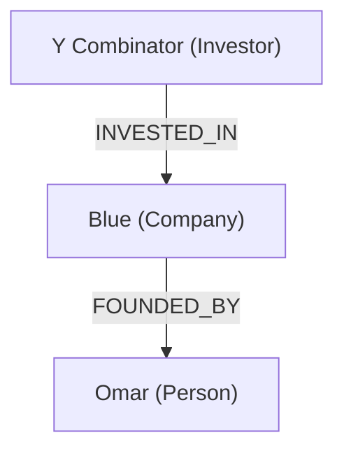

# 🚀 创业公司分析报告 · Blue

**生成时间**: 2025-08-13 22:44:14

## 🧩 核心要素

| 要素 | 内容 |
|---|---|
| 公司名称 | Blue |
| 成立时间 | 2024-01-01 |
| 所属领域 | AI, hardware, speech-recognition |
| 价值主张 | True voice control for your phone. |
| 简介/产品 | Voice assistant enabling hands-free operation across apps. |

## 🧠 LLM 分析摘要（原文）

（这里填 LLM 的 One-Pager 文本或 JSON 节选）

## 🔗 关系图谱

## 🗂️ 证据与来源

| 标题 | URL | 等级 | 抓取时间 |
|---|---|---|---|
| Company Website | https://heyblue.com | L2 | 2025-08-13 |

---
**数据与方法**：公开信息 + 知识图谱推理 + 大模型分析

_本报告仅供参考，不构成投资建议。_